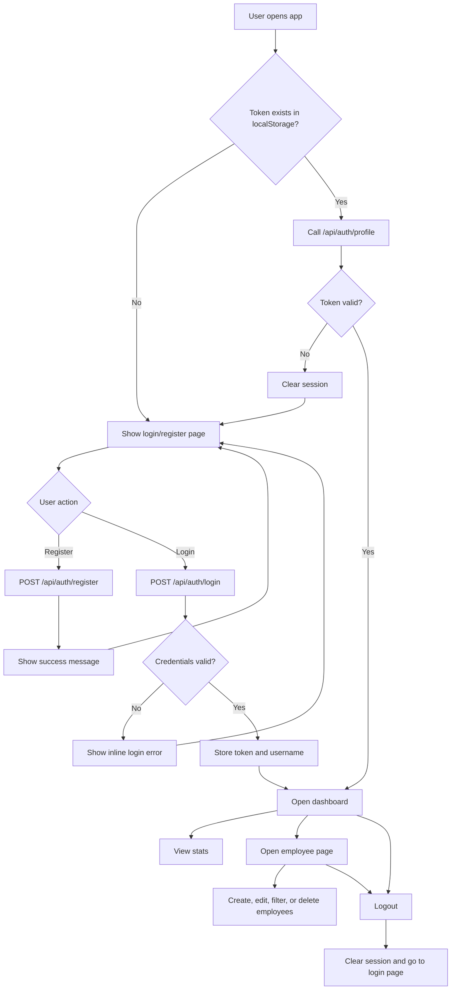
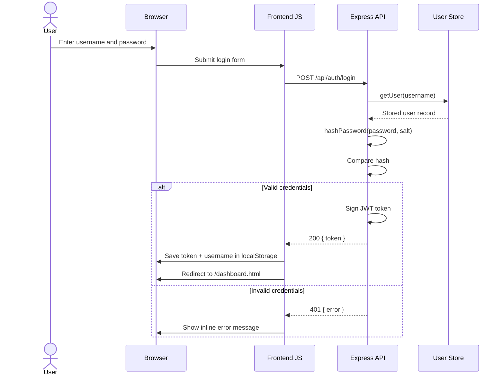
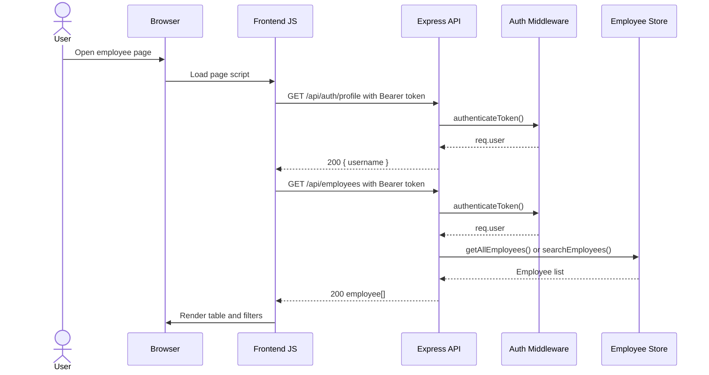

# Current Application Guide

This document explains how the current Employee Management System works today.

## Overview

The application is a small full-stack web app with:

- An Express backend that serves both the REST API and the frontend files
- JWT-based authentication for protected API routes
- In-memory storage for users and employees
- A vanilla HTML, CSS, and JavaScript frontend

## Main components

### Backend

- `src/server.js`
  Starts the Express server on port `3000` by default.

- `src/app.js`
  Configures middleware, serves static frontend files from `public/`, mounts auth routes under `/api/auth`, and mounts protected employee routes under `/api/employees`.

- `src/routes/auth.routes.js`
  Handles registration, login, and profile lookup.

- `src/routes/employee.routes.js`
  Handles employee CRUD operations, filtering, and dashboard statistics.

- `src/middleware/auth.middleware.js`
  Verifies JWT bearer tokens and blocks unauthenticated access.

- `src/middleware/validation.middleware.js`
  Validates employee input before create and update operations.

- `src/models/user.store.js`
  Stores users in memory and hashes passwords with PBKDF2.

- `src/models/employee.store.js`
  Stores employee records in memory and calculates aggregate statistics.

### Frontend

- `public/index.html`
  Login and registration page.

- `public/dashboard.html`
  Landing page after login. Shows a greeting, summary cards, and breakdown data.

- `public/employees.html`
  Employee list page with filters, create/edit modal, and delete actions.

- `public/js/api.js`
  Shared frontend helper for token/session handling and API calls.

- `public/js/auth.js`
  Login and registration page logic.

- `public/js/dashboard.js`
  Dashboard page logic and greeting rendering.

- `public/js/employees.js`
  Employee table, filtering, and CRUD UI logic.

## Data model

### User

Current user records are stored in memory as:

```js
{
  username,
  password, // hashed password
  salt
}
```

### Employee

Employee records are stored in memory as:

```js
{
  id,
  name,
  email,
  department,
  role,
  hireDate,
  salary,
  createdAt,
  updatedAt
}
```

## Authentication flow

1. A user opens the login page.
2. The frontend checks whether a token already exists in `localStorage`.
3. If a token exists, the frontend validates it by calling `/api/auth/profile`.
4. If the token is valid, the user is redirected to the dashboard.
5. If the token is invalid or expired, the local session is cleared and the user stays on the login page.
6. On successful login, the frontend stores the JWT token and username in `localStorage`.
7. Protected pages use the stored token for API requests.
8. Logout clears the token and username from `localStorage` and returns the user to the login page.

## User flow chart

If Mermaid is not rendering in the editor, open Markdown Preview in VS Code with `Cmd+Shift+V`.
The plain-text fallback flow is included below the diagram.



  Plain-text fallback:

  1. User opens the app.
  2. The app checks whether a token exists in local storage.
  3. If there is no token, the login and register page is shown.
  4. If a token exists, the frontend validates it with `/api/auth/profile`.
  5. If the token is invalid, the session is cleared and the user returns to login.
  6. If the token is valid, the user lands on the dashboard.
  7. From login, the user can either register or log in.
  8. Successful registration returns the user to the login form.
  9. Successful login stores the token and username, then opens the dashboard.
  10. From the dashboard, the user can view stats, open the employee page, or log out.
  11. From the employee page, the user can create, edit, filter, or delete employees.
  12. Logout clears the session and returns the user to the login page.

## Login sequence diagram



    Plain-text fallback:

    1. The user submits the login form in the browser.
    2. Frontend JavaScript sends `POST /api/auth/login`.
    3. The server loads the user from the in-memory user store.
    4. The server hashes the submitted password using the stored salt.
    5. The server compares the calculated hash with the stored hash.
    6. If the credentials are valid, the server signs a JWT and returns it.
    7. The frontend stores the token and username in local storage.
    8. The browser redirects to the dashboard.
    9. If the credentials are invalid, the server returns `401` and the frontend shows an inline error.

## Protected API sequence diagram



  Plain-text fallback:

  1. The user opens a protected page such as the employee page.
  2. The frontend first calls `/api/auth/profile` using the stored bearer token.
  3. The auth middleware validates the token and attaches the user to the request.
  4. If the token is valid, the API returns the current username.
  5. The frontend then requests `/api/employees` with the same bearer token.
  6. The auth middleware validates the token again.
  7. The employee store returns all employees or filtered employees.
  8. The frontend renders the employee table and filters in the browser.

## Available API endpoints

### Auth endpoints

- `POST /api/auth/register`
- `POST /api/auth/login`
- `GET /api/auth/profile`

### Employee endpoints

- `GET /api/employees/stats`
- `GET /api/employees`
- `GET /api/employees/:id`
- `POST /api/employees`
- `PUT /api/employees/:id`
- `DELETE /api/employees/:id`

## Validation and error handling

Employee create and update requests are validated for:

- required name
- valid email format
- required department
- required role
- valid hire date
- positive salary

Common HTTP responses:

- `200` for successful reads and updates
- `201` for successful creation
- `204` for successful deletion
- `400` for bad input or invalid employee ID
- `401` for missing authentication token
- `403` for invalid or expired token
- `404` for missing employee
- `409` for duplicate username during registration

## Current limitations

- Data is stored in memory only, so users and employees are lost when the server restarts.
- Authentication is basic and does not include roles or permissions.
- Frontend logic is browser-side JavaScript without a component framework.

## Test coverage summary

The current codebase includes:

- Unit tests for stores and middleware
- Route tests for authentication and employee APIs
- Existing workshop tests in `auth.test.js` and `factorial.test.js`